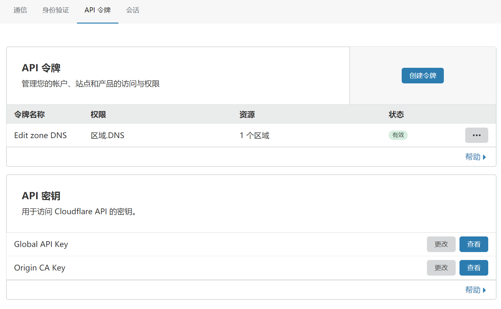

#  前言

ACME（自动证书管理环境）是Let's Encrypt用以实现新的数字证书认证机构的协议，旨在以自动化流程消除手动创建和安装证书的复杂流程，并推广使万维网服务器的加密连接无所不在，为安全网站提供免费的SSL/TLS证书。

ACME只是一个协议，任何人都可以利用这个协议实现一个客户端，获取免费的证书，例如Certbot、acme.sh等Caddy中的自动证书也是基于这个协议。

官方主推的Certbot客户端，不过acme.sh用的很方便，也就不再去折腾了。

Let's Encrypt官方文档：https://letsencrypt.org/zh-cn/docs/

acme.sh中文文档：[https://github.com/acmesh-official/acme.sh/wiki/%E8%AF%B4%E6%98%8E](https://github.com/acmesh-official/acme.sh/wiki/说明)

<!--more-->

# 安装acme.sh

**脚本安装**

```bash
curl  https://get.acme.sh | sh
```

安装完后所有的文件都在用户的home目录下：`~/.acme.sh/`

并且会自动创建一个cronjob，每天0:00自动检测所有的证书。

**验证方法**

```bash
#查看crontab
crontab -l
#生成的cronjob
0 0 * * * "/root/.acme.sh"/acme.sh --cron --home "/root/.acme.sh" > /dev/null
```

**创建别名**

创建别名是为了方便命令配置

```bash
alias acme.sh='/root/.acme.sh/acme.sh'
```

# 生成证书

**acme.sh** 实现了 **acme** 协议支持的所有验证协议. 一般有两种方式验证: http 和 dns 验证.

## HTTP方式

1、http 方式需要在你的网站根目录下放置一个文件, 来验证你的域名所有权,完成验证. 然后就可以生成证书了

```bash
acme.sh  --issue  -d mydomain.com -d www.mydomain.com  --webroot  /home/wwwroot/mydomain.com/
```

2、如果使用apache或者nginx可以不需要指定根目录

```bash
acme.sh --issue  -d mydomain.com   --apache
acme.sh --issue  -d mydomain.com   --nginx
```

3、如果没有运行web服务，那么 **acme.sh** 还能假装自己是一个webserver, 临时听在**80** 端口, 完成验证

```bash
acme.sh  --issue -d mydomain.com   --standalone
```

## DNS方式

### 获取API信息

DNS方式需要在域名商添加一条TXT的解析记录，以验证域名所有权。

**acme.sh** 目前支持 cloudflare, dnspod, cloudxns, godaddy 以及 ovh 等数十种解析商的自动集成，即通过API接口，自动添加TXT记录，完成自动验证。

具体接口参数可以参看官方文档：https://github.com/acmesh-official/acme.sh/wiki/dnsapi

以 Cloudflare 为例, 先登录到 Cloudflare  账号, 生成 [API Key](https://dash.cloudflare.com/profile/api-tokens)，查看Global API Key



### 设置环境变量

就是Cloudflare的全局Key和注册邮箱

```bash
export CF_Key="sdfsdfsdfljlbjkljlkjsdfoiwje"
export CF_Email="xxxx@sss.com"
```

这个临时环境变量只需配置这一次，当成功申请证书后，API 信息会被自动保存在`~/.acme.sh/account.conf`下次使用`acme.sh`时候会被自动调用。

### 申请证书

`domain.com`换成自己的域名即可

```bash
acme.sh --issue --dns dns_cf -d domain.com -d *.domain.com
```

### API Token 方式

Cloudflare是可以对单域创建Tokens的，如果不放心使用全局Key，可以使用API Token。

但是在使用的时候需要注意权限配置及作用范围

| Permissions         | Resources |
| ------------------- | --------- |
| Zone.Zone, Zone.DNS | All zones |

在配置变量时只需要配置`CF_Token` `CF_Account_ID`

```
export CF_Token="sdfsdfsdfljlbjkljlkjsdfoiwje"
export CF_Account_ID="sdfsdfsdfljlbjkljlkjsdfoiwje"
```

# 安装证书

默认生成的证书都放在安装目录下: `~/.acme.sh/`, 请不要直接使用此目录下的文件, 例如: 不要直接让 nginx/apache 的配置文件使用这下面的文件. 这里面的文件都是内部使用, 而且目录结构可能会变化.

正确的使用方法是使用 `--installcert` 命令,并指定目标位置, 然后证书文件会被copy到相应的位置

```bash
acme.sh --installcert -d domain.com \
--key-file       /path/to/ssl/domain.com.key  \
--fullchain-file /path/to/ssl/domain.com.cert \
--reloadcmd     "systemctl force-reload nginx squid"
```

证书每次续期后会自动重启nginx，使用`force-reload`而不是`reload`

# 更新相关

## 证书更新

目前证书在 60 天以后会自动更新, 无需任何操作. 都是自动更新的

## 更新acme.sh

配置自动更新acme.sh程序

```bash
acme.sh  --upgrade  --auto-upgrade
```

